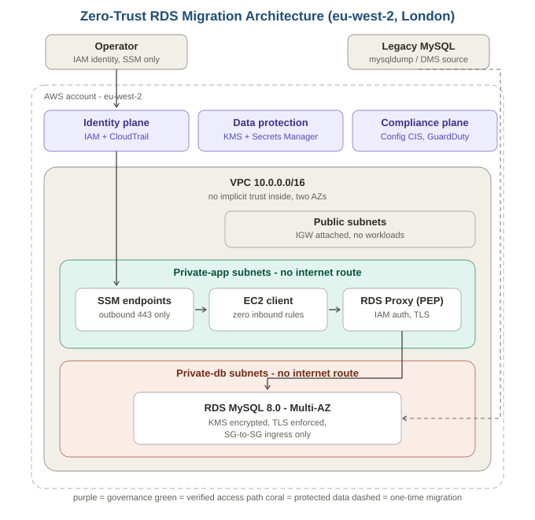

# Zero-Trust Migration Framework: Legacy MySQL to Amazon RDS

**Start here: [IMPLEMENTATION.md](IMPLEMENTATION.md) — the full deploy-and-test pathway.**

MSc Cyber Security dissertation artefact. Modular Terraform deploying a
zero-trust AWS environment for re-platforming a legacy MySQL database to
Amazon RDS, with IaC security scanning (Checkov) and CIS Benchmark
compliance validation (AWS Config conformance pack).

## Architecture

See docs/architecture.svg for the full diagram. Every module carries a teaching
header explaining what it is, why it is designed this way, its real-world uses,
and the alternatives considered — read them top to bottom, they are the design
rationale for the dissertation.

- Three-tier VPC in eu-west-2 (public / private-app / private-db)
- Private subnets have no internet route in either direction
- Admin access exclusively via SSM Session Manager - no SSH keys exist
- RDS MySQL: private, KMS-encrypted, credentials in Secrets Manager,
  IAM database authentication enabled
- App instance: no inbound rules, IMDSv2 enforced, encrypted root volume

## Deploy
1. `cd bootstrap && terraform init && terraform apply` (once - creates state backend)
2. Put the printed bucket name into `environments/dev/backend.tf`
3. `cd environments/dev && terraform init && terraform apply`
4. Compliance stack (Config + CIS + CloudTrail) deploys with
   `-var deploy_compliance=true` - see cost note in the module.

## Security scanning
Checkov runs on every push via GitHub Actions (`.github/workflows`).
